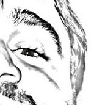

# Estructuras de Datos y Algoritmos 1 (EDA 1)

Bienvenido al sitio oficial de **Estructuras de Datos y Algoritmos 1** / **Programación 2** de la Universidad Nacional de Luján.

---

## 📚 Recursos principales

### [Guía de Trabajos Prácticos](https://unlu-prog-2.github.io/guia-tp/)
Prácticas, trabajos prácticos y ejercicios propuestos para cada unidad temática. Aquí encontrarás todo el material necesario para practicar los conceptos cubiertos en clase.

- **TP0**: Repaso de conceptos previos
- **TP1-TP6**: Temas desde recursividad hasta árboles
- **Guías específicas** para EDA 1 y Programación 2

### [Guía Base](https://unlu-prog-2.github.io/guia-base/)
Implementaciones de TADs (Tipos Abstractos de Datos) y estructuras de datos fundamentales en C. Este repositorio contiene:

- Listas, pilas y colas
- Árboles (binarios, AVL, etc.)
- Tablas hash
- Conjuntos
- Utilidades y aserciones

---

## 👨‍🏫 Equipo docente

- **Mario Perello** — Profesor Responsable
- **Jose Racker** — JTP (Luján)
- **Mariano Goldman** — Ayudante (Chivilcoy)
- **Claudia Reinaudi** — Ayudante (Luján)
- **Franco Parzanese** — Ayudante (Chivilcoy)

---

## 📖 Estructura del contenido

La asignatura cubre los siguientes temas:

| Tema                   | Descripción                     |
|------------------------|---------------------------------|
| **Repaso (TP0)**       | Conceptos previos necesarios    |
| **Recursividad (TP1)** | Funciones recursivas y análisis |
| **TADs (TP2)**         | Tipos Abstractos de Datos       |
| **Listas (TP3)**       | Listas enlazadas y dinámicas    |
| **Pilas (TP4)**        | Estructuras LIFO                |
| **Colas (TP5)**        | Estructuras FIFO                |
| **Árboles (TP6)**      | Árboles binarios y AVL          |

---

## 🔗 Enlaces rápidos

- [Repositorio de Guía de Trabajos Prácticos](https://github.com/unlu-prog-2/guia-tp)
- [Repositorio de Guía Base](https://github.com/unlu-prog-2/guia-base)

---

## En memoria de Pablo Chale

**Pablo Chale** fue parte muy valiosa de esta cátedra.  
Su dedicación a la enseñanza, la cercanía con las y los estudiantes y el compromiso con la Universidad dejaron una huella profunda.

> Lo recordamos con cariño y gratitud.  
> Su aporte sigue presente en el espíritu de esta guía y en quienes aprendimos con él.
