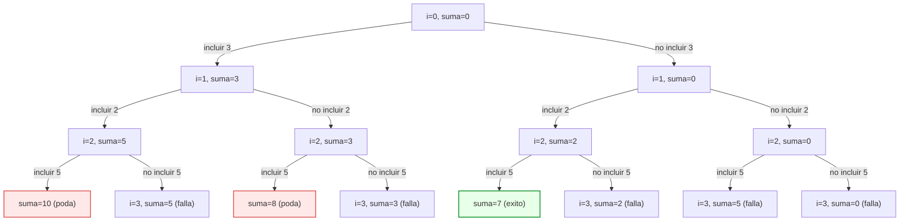

[← Volver a Programación II](../guia-prog2.md)

# Introducción rápida a Backtracking

Backtracking es una técnica para resolver problemas de búsqueda construyendo soluciones "de a poco".

La idea central es:

1. Probar una decisión.
2. Avanzar recursivamente.
3. Si esa decisión lleva a un callejón sin salida, deshacerla.
4. Probar otra alternativa.

Por eso también se lo conoce como prueba y error con retroceso.

## ¿Para qué problemas se usa?

Se usa cuando:

- hay muchas combinaciones posibles;
- queremos encontrar una solución válida (o todas);
- podemos detectar temprano que un camino no sirve y podarlo.

Problemas clásicos:

- laberintos;
- sudoku;
- n reinas;
- combinaciones/permutaciones con restricciones.

## Ejemplo simple: subconjunto con suma objetivo

Dado un arreglo de enteros positivos `v` y un objetivo `objetivo`, queremos saber si existe un subconjunto cuya suma sea exactamente `objetivo`.

Ejemplo:

- `v = [3, 2, 5]`
- `objetivo = 7`

Una solución existe: `2 + 5 = 7`.

### Idea algorítmica (paso a paso)

En cada posición `i` tenemos dos decisiones:

- incluir `v[i]`;
- no incluir `v[i]`.

Llevamos una suma parcial `suma`.

1. Si `suma == objetivo`, encontramos solución.
2. Si `suma > objetivo`, no tiene sentido seguir por ese camino (poda).
3. Si `i == n` y no llegamos al objetivo, ese camino falla.
4. Si ninguna decisión funciona, retrocedemos.

Recorrido breve del ejemplo:

1. Inicio: `i=0`, `suma=0`.
2. Incluir `3` -> `i=1`, `suma=3`.
3. Incluir `2` -> `i=2`, `suma=5`.
4. Incluir `5` -> `suma=10` (se poda: supera 7).
5. Retroceder: no incluir `5` -> fin de ese camino, falla.
6. Retroceder: no incluir `2` -> `i=2`, `suma=3`.
7. Incluir `5` -> `suma=8` (se poda).
8. Retroceder: no incluir `5` -> falla.
9. Retroceder al inicio: no incluir `3` -> `i=1`, `suma=0`.
10. Incluir `2` -> `i=2`, `suma=2`.
11. Incluir `5` -> `suma=7`, éxito.

Árbol de decisiones del mismo recorrido:



## Implementación en C

```c
#include <stdbool.h>
#include <stdio.h>

bool hay_subconjunto_suma_rec(const int v[], int n, int i, int suma, int objetivo) {
    if (suma == objetivo) {
        return true;
    }

    if (suma > objetivo || i == n) {
        return false;
    }

    if (hay_subconjunto_suma_rec(v, n, i + 1, suma + v[i], objetivo)) {
        return true;
    }

    return hay_subconjunto_suma_rec(v, n, i + 1, suma, objetivo);
}

bool hay_subconjunto_suma(const int v[], int n, int objetivo) {
    return hay_subconjunto_suma_rec(v, n, 0, 0, objetivo);
}

int main(void) {
    int v[] = {3, 2, 5};
    int n = (int)(sizeof(v) / sizeof(v[0]));
    int objetivo = 7;

    if (hay_subconjunto_suma(v, n, objetivo)) {
        printf("Existe un subconjunto con suma %d\n", objetivo);
    } else {
        printf("No existe un subconjunto con suma %d\n", objetivo);
    }

    return 0;
}
```

## Complejidad algorítmica

En el peor caso, en cada posición tomamos dos decisiones (incluir o no incluir). Eso genera un árbol de búsqueda de tamaño aproximado $2^n$.

Por eso:

- tiempo en peor caso: $O(2^n)$;
- memoria extra: $O(n)$ por la profundidad de la recursión.

La poda (por ejemplo, cortar cuando `suma > objetivo`) mejora muchos casos prácticos, pero no cambia el peor caso asintótico.

## Segundo ejemplo: laberinto pequeño

Ahora vemos un ejemplo en el que hay que buscar la salida en un laberinto.

Mapa (5x5):

|   | 1 | 2 | 3 | 4 | 5 |
|---|---|---|---|---|---|
| 1 | I | . | . | . | # |
| 2 | # | # | . | . | # |
| 3 | . | . | . | # | # |
| 4 | # | . | . | S | # |
| 5 | # | # | # | # | # |

- `I`: inicio
- `S`: salida
- `#`: bloqueada
- `.`: libre

Objetivo: encontrar un camino de `I` a `S` moviéndonos en 4 direcciones.

### Idea algorítmica

En cada celda `(f, c)`:

1. Si está fuera de rango o bloqueada, ese camino falla.
2. Si ya fue visitada en el camino actual, falla (evita ciclos).
3. Si es la salida, éxito.
4. Guardar el carácter actual y marcar temporalmente con `V`.
5. Probar movimientos en un orden fijo (por ejemplo `Arriba`, `Abajo`, `Derecha`, `Izquierda`).
6. Si ninguno funciona, restaurar el carácter original (backtracking) y devolver falla.

Ese desmarcado es clave: permite que la celda pueda ser usada por otro camino alternativo.

### Recorrido breve

Una traza posible sería:

1. Desde `I` se prueba Arriba y falla (fuera de rango).
2. Se prueba Abajo y falla (`#`).
3. Se prueba Derecha y avanza.
4. Más adelante se llega a una celda sin salida útil.
5. Se retrocede desmarcando celdas.
6. Se intenta otra alternativa en una decisión anterior.
7. Finalmente se llega a `S`.

### Implementación en C (núcleo recursivo)

```c
#include <stdbool.h>

bool buscar_salida(
    char **mapa,
    int filas,
    int columnas,
    int f,
    int c
) {
    if (f < 0 || f >= filas || c < 0 || c >= columnas) {
        return false;
    }

    if (mapa[f][c] == '#' || mapa[f][c] == 'V') {
        return false;
    }

    if (mapa[f][c] == 'S') {
        return true;
    }

    char anterior = mapa[f][c];
    mapa[f][c] = 'V';

    // Orden fijo de prueba: Arriba, Abajo, Derecha, Izquierda
    if (buscar_salida(mapa, filas, columnas, f - 1, c) ||
        buscar_salida(mapa, filas, columnas, f + 1, c) ||
        buscar_salida(mapa, filas, columnas, f, c + 1) ||
        buscar_salida(mapa, filas, columnas, f, c - 1)) {
        mapa[f][c] = anterior;
        return true;
    }

    mapa[f][c] = anterior;
    return false;
}
```

### Complejidad de este tipo de búsqueda

Si la grilla tiene `F` filas y `C` columnas, llamando `N = F * C`:

- peor caso de tiempo: exponencial, típicamente acotado por $O(4^N)$;
- memoria extra: $O(N)$ por la profundidad de la recursión (sin estructura adicional de visitados).

En la práctica, las podas (bloqueos, límites, visitados y orden de movimientos) reducen mucho la exploración real.


## Resumen

Backtracking explora decisiones de forma sistemática, deshace cuando una rama no sirve y sigue con otra. Es muy útil para problemas combinatorios con restricciones, especialmente cuando podemos podar ramas temprano.
