# Instalación de compilador C y CMake

Esta guía te ayudará a configurar las herramientas base para programar en C: el compilador (MinGW) y CMake.

Si querés continuar con el editor, consultá la guía de VS Code en [configuracion-vscode.md](configuracion-vscode.md).

## Contenido

1. [Instalación de MinGW](#1-instalacin-de-mingw)
2. [Instalación de CMake](#2-instalacin-de-cmake)

---

## 1. Instalación de MinGW

MinGW (Minimalist GNU for Windows) es un port de las herramientas de desarrollo GNU para Windows, que incluye el compilador GCC para C/C++.

### Paso 1: Buscar MinGW

1. Abre tu navegador y busca "mingw" en Google
2. Accede al sitio de SourceForge: [https://sourceforge.net/projects/mingw/](https://sourceforge.net/projects/mingw/)


### Paso 2: Descargar MinGW

1. En la página de SourceForge, haz clic en el botón "Download"
2. Se descargará el archivo `mingw-get-setup.exe`

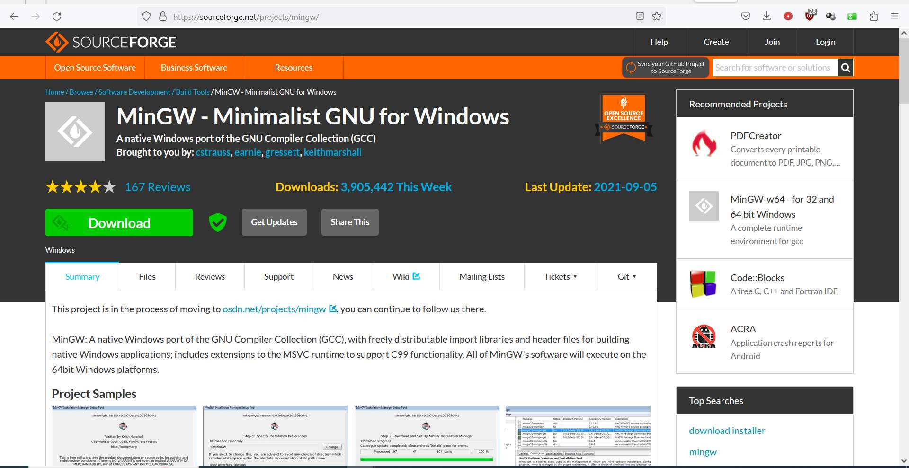

### Paso 3: Ejecutar el instalador

1. Ejecuta el archivo `mingw-get-setup.exe`
2. Verás la ventana de bienvenida del MinGW Installation Manager Setup Tool
3. Haz clic en "Install"

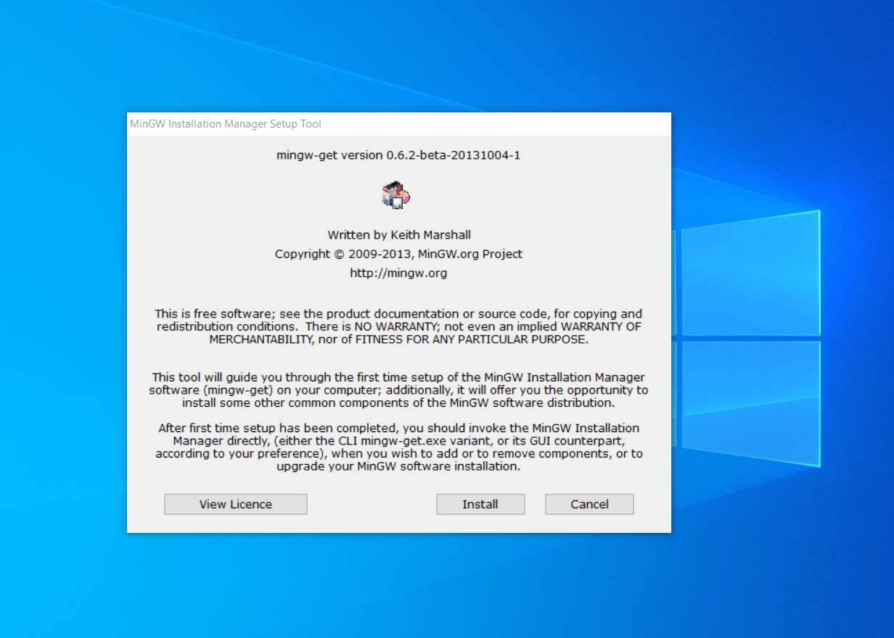

### Paso 4: Configurar directorio de instalación

1. Mantén el directorio de instalación por defecto: `C:\MinGW`
2. Haz clic en "Continue"

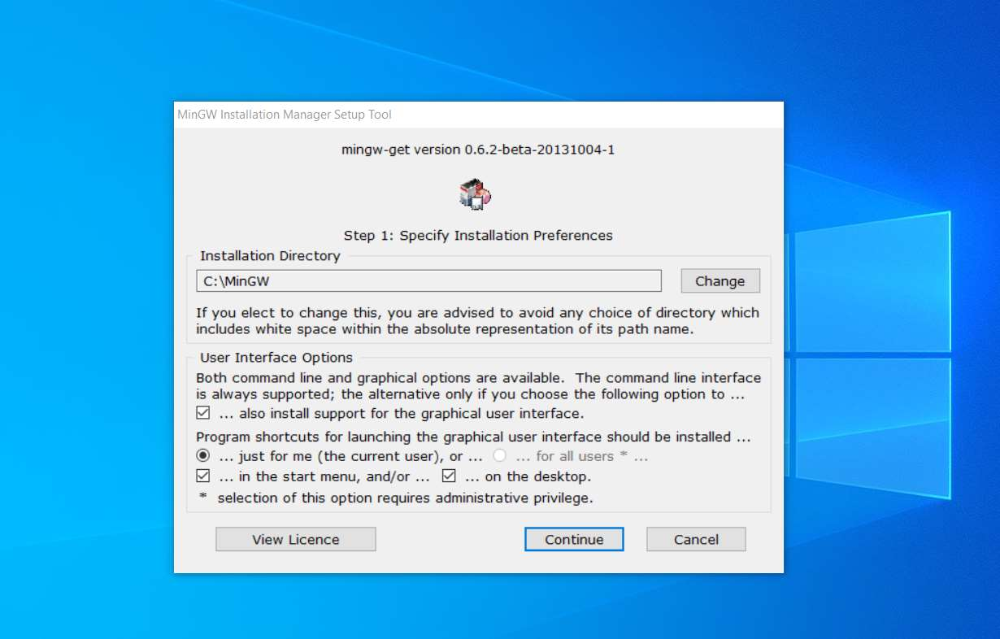

### Paso 5: Descargar catálogos

Espera mientras el instalador descarga los catálogos necesarios.

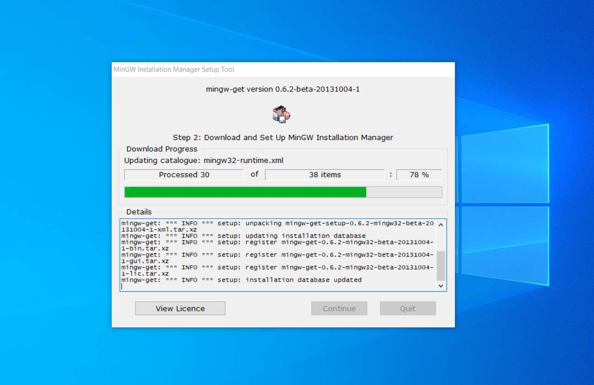

### Paso 6: Completar descarga de catálogos

Cuando la descarga se complete, verás el mensaje "Catalogue update completed"
Haz clic en "Continue"

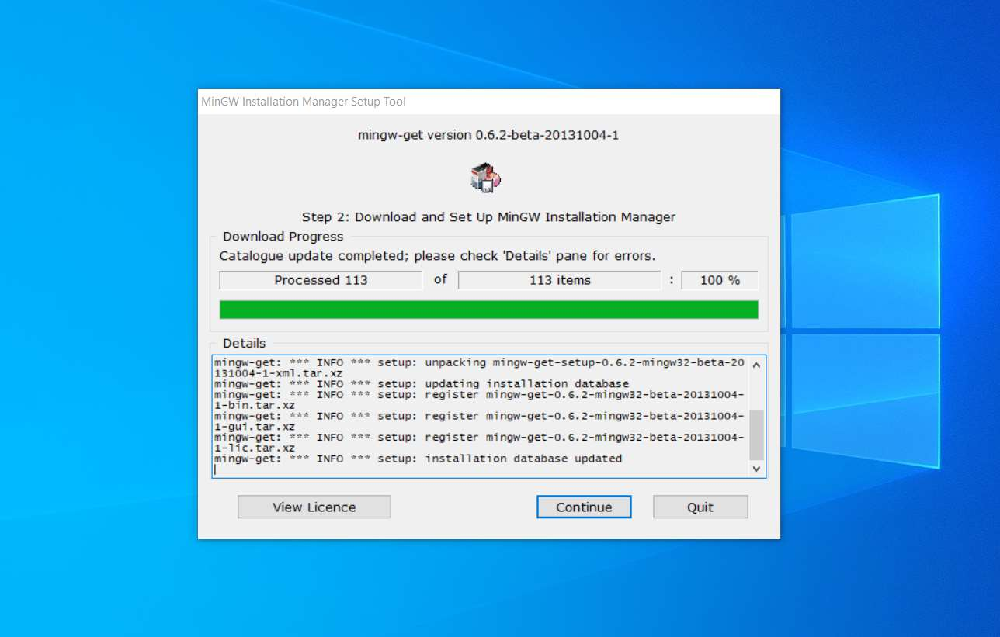

### Paso 7: Seleccionar paquetes

En el MinGW Installation Manager:
1. Marca para instalación: `mingw32-gcc-g++` (The GNU C++ Compiler)
2. Haz clic derecho sobre el paquete y selecciona "Mark for Installation"

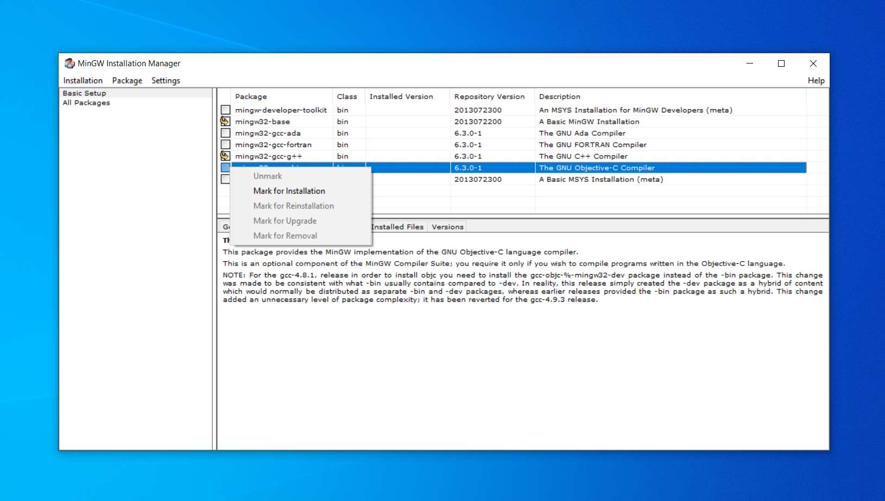

### Paso 8: Aplicar cambios

1. Ve al menú "Installation" > "Apply Changes"
2. Verás un resumen de los paquetes que se instalarán
3. Haz clic en "Apply"

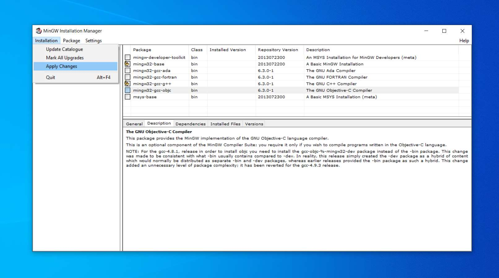

### Paso 9: Instalación de paquetes

Espera mientras se instalan todos los paquetes necesarios.

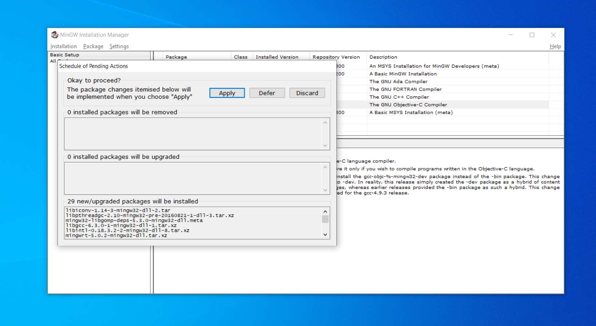

### Paso 10: Verificar instalación

Una vez completada la instalación:
1. Navega a `C:\MinGW\bin`
2. Verás archivos como `gcc.exe`, `g++.exe`, etc.

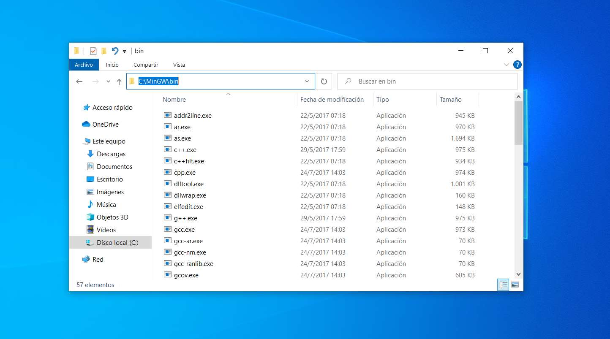

### Paso 11: Configurar variables de entorno

Para poder usar el compilador desde cualquier ubicación:

1. Busca "variables de entorno" en el menú de Windows
2. Haz clic en "Editar las variables de entorno del sistema"

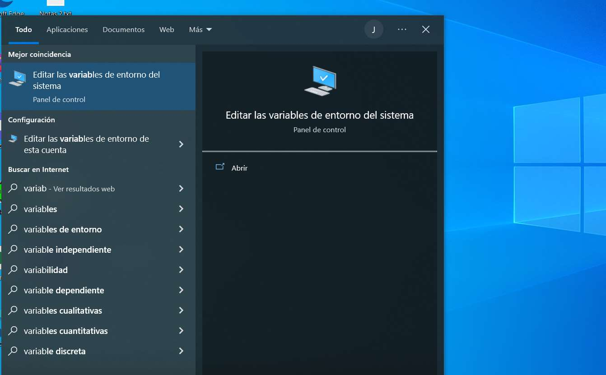

### Paso 12: Editar la variable PATH

1. En las propiedades del sistema, haz clic en "Variables de entorno..."
2. En "Variables de usuario", selecciona "Path" y haz clic en "Editar..."
3. Haz clic en "Nuevo" y agrega: `C:\MinGW\bin`
4. Haz clic en "Aceptar" en todas las ventanas

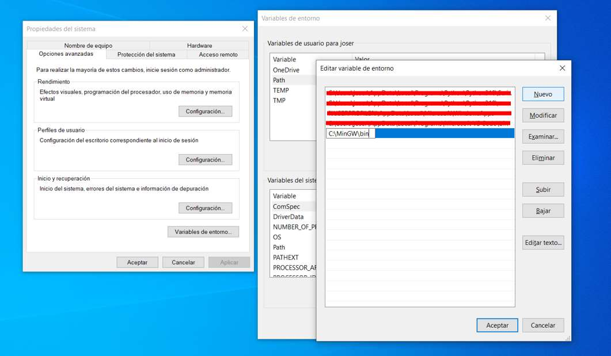

### Paso 13: Verificar la instalación

Abre un símbolo del sistema y ejecuta:

```bash
gcc --version
```

Deberías ver algo como:
```
gcc (MinGW.org GCC-6.3.0-1) 6.3.0
This is free software; see the source for copying conditions. There is NO
warranty; not even for MERCHANTABILITY or FITNESS FOR A PARTICULAR PURPOSE.
```

Si funciona correctamente, verás:
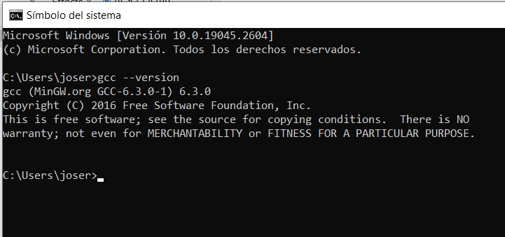

Errores posibles: si faltó agregar la carpeta `C:\MinGW\bin` a la variable PATH verás un error como:
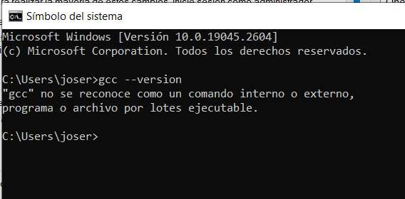


---

## 2. Instalación de CMake

CMake es un sistema de generación de archivos de construcción multiplataforma que facilita la gestión de proyectos C/C++. Permite definir la estructura del proyecto y sus dependencias de forma independiente del compilador.

### ¿Qué es CMake?

CMake lee archivos de configuración llamados `CMakeLists.txt` y genera los archivos necesarios para compilar tu proyecto (como Makefiles). Esto hace que sea más fácil:
- Gestionar proyectos con múltiples archivos fuente
- Organizar el código en bibliotecas y ejecutables
- Manejar dependencias entre módulos
- Compilar el proyecto en diferentes plataformas

### Paso 1: Descargar CMake

1. Ve al sitio oficial de CMake: [https://cmake.org/download/](https://cmake.org/download/)
2. En la sección "Binary distributions", busca la versión para Windows
3. Descarga el instalador (archivo `.msi`) para la última versión estable
   - Ejemplo: `cmake-3.XX.X-windows-x86_64.msi`

[//]: # (![Página de descarga de CMake]&#40;imagenes/cmake-download.jpg&#41;)

### Paso 2: Ejecutar el instalador

1. Ejecuta el archivo `.msi` descargado
2. Aparecerá el asistente de instalación de CMake
3. Haz clic en "Next" para continuar

[//]: # (![Instalador de CMake - Bienvenida]&#40;imagenes/cmake-installer-welcome.jpg&#41;)

### Paso 3: Aceptar la licencia

1. Lee el acuerdo de licencia
2. Marca "I accept the terms in the License Agreement"
3. Haz clic en "Next"

[//]: # (![Acuerdo de licencia de CMake]&#40;imagenes/cmake-license.jpg&#41;)

### Paso 4: Configurar PATH

Esta es la opción más importante. Selecciona:
- **"Add CMake to the system PATH for all users"** (recomendado)
  - O "Add CMake to the system PATH for the current user" si no tienes permisos de administrador

Esto te permitirá usar CMake desde cualquier terminal sin necesidad de especificar la ruta completa.

[//]: # (![Configurar PATH de CMake]&#40;imagenes/cmake-path-option.jpg&#41;)

### Paso 5: Seleccionar carpeta de instalación

1. Mantén la carpeta por defecto: `C:\Program Files\CMake`
2. O selecciona una ubicación diferente si lo prefieres
3. Haz clic en "Next"

[//]: # (![Carpeta de instalación de CMake]&#40;imagenes/cmake-install-folder.jpg&#41;)

### Paso 6: Instalar

1. Haz clic en "Install" para comenzar la instalación
2. Espera mientras se copian los archivos

[//]: # (![Instalando CMake]&#40;imagenes/cmake-installing.jpg&#41;)

### Paso 7: Completar la instalación

1. Una vez finalizada la instalación, haz clic en "Finish"

[//]: # (![Instalación completa de CMake]&#40;imagenes/cmake-complete.jpg&#41;)

### Paso 8: Verificar la instalación

Abre un símbolo del sistema (o PowerShell) y ejecuta:

```bash
cmake --version
```

Deberías ver algo como:

```
cmake version 3.XX.X

CMake suite maintained and supported by Kitware (kitware.com/cmake).
```

[//]: # (![Verificar instalación de CMake]&#40;imagenes/cmake-verify.jpg&#41;)

### Uso básico de CMake

Para usar CMake en tus proyectos, necesitarás crear un archivo `CMakeLists.txt` en la raíz de tu proyecto. Ejemplo básico:

```cmake
# Versión mínima de CMake requerida
cmake_minimum_required(VERSION 3.10)

# Nombre del proyecto
project(MiProyecto)

# Estándar de C
set(CMAKE_C_STANDARD 11)

# Agregar ejecutable
add_executable(programa main.c funciones.c)
```

Para compilar tu proyecto con CMake:

```bash
# Crear carpeta de construcción
mkdir build
cd build

# Generar archivos de construcción
cmake ..

# Compilar el proyecto
cmake --build .
```

---


## Recursos adicionales

- [Guía de instalación y configuración de VS Code](configuracion-vscode.md)
- [Documentación oficial de CMake](https://cmake.org/documentation/)
- [Documentación de MinGW](http://www.mingw.org/)
