# Configuración de Visual Studio Code para desarrollar en C

Esta guía te ayudará a instalar y configurar Visual Studio Code para programar en C.

Antes de continuar, asegurate de tener instalado el compilador y CMake siguiendo [configuracion-entorno.md](configuracion-entorno.md).

## Contenido

1. [Instalación de Visual Studio Code](#1-instalacin-de-visual-studio-code)
2. [Instalación de extensiones de Visual Studio Code](#2-instalacin-de-extensiones-de-visual-studio-code)
3. [Primer programa C en Visual Studio Code](#3-primer-programa-c-en-visual-studio-code)

---

## 1. Instalación de Visual Studio Code

### Paso 1: Descargar Visual Studio Code

1. Ve al sitio oficial de Visual Studio Code: [https://code.visualstudio.com](https://code.visualstudio.com)
2. Descarga el instalador para tu sistema operativo (Windows, macOS o Linux)

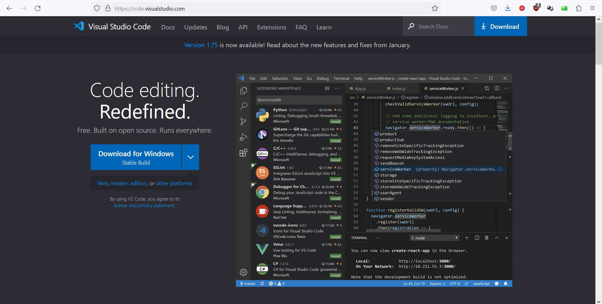

### Paso 2: Ejecutar el instalador

1. Ejecuta el instalador descargado
2. Acepta el acuerdo de licencia

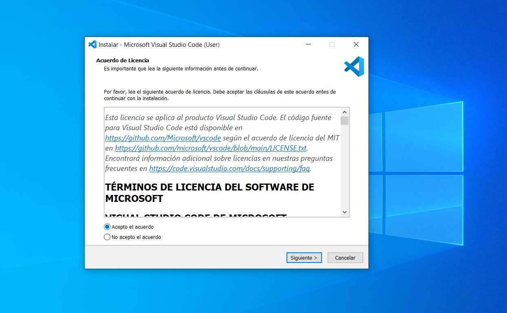

### Paso 3: Configurar la instalación

1. Selecciona la carpeta de destino (por defecto: `C:\Users\[usuario]\AppData\Local\Programs\Microsoft VS Code`)
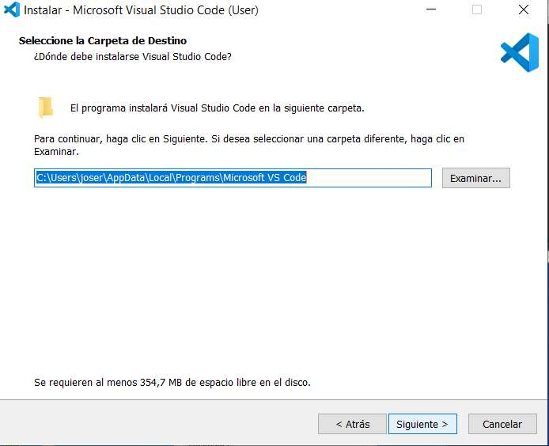

2. Selecciona la carpeta del menú inicio (por defecto: `Visual Studio Code`)
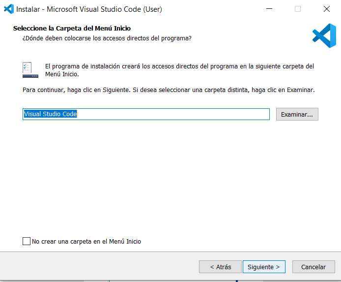

### Paso 4: Opciones adicionales

Marca las siguientes opciones recomendadas:
- ✓ Crear un icono en el escritorio
- ✓ Añadir "Abrir con Code" al menú contextual de archivos
- ✓ Agregar a PATH (disponible después de reiniciar)

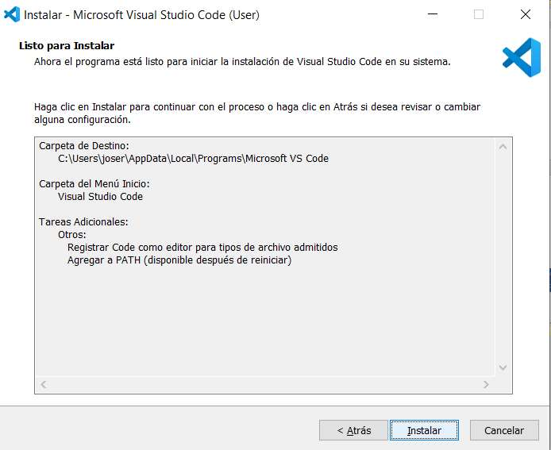

### Paso 5: Completar la instalación

1. Haz clic en "Instalar"
2. Espera a que se complete la instalación
3. Marca la opción "Ejecutar Visual Studio Code"
4. Haz clic en "Finalizar"

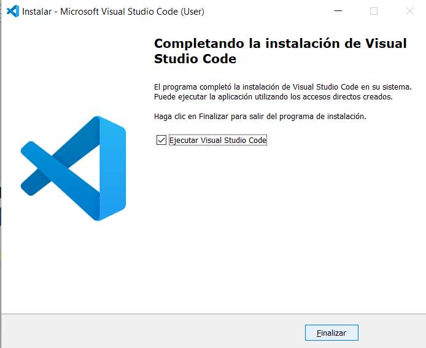

---

## 2. Instalación de extensiones de Visual Studio Code

Las extensiones añaden funcionalidades específicas para el desarrollo en C/C++.

### Paso 1: Abrir el panel de extensiones

1. Abre Visual Studio Code
2. Haz clic en el icono de extensiones en la barra lateral izquierda (o presiona `Ctrl+Shift+X`)

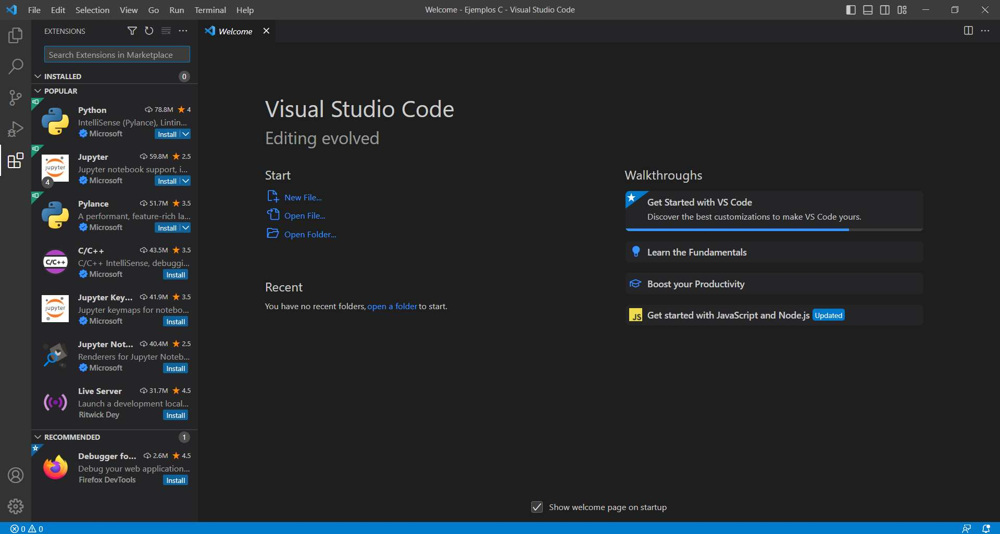

### Paso 2: Buscar extensiones de C/C++

En el cuadro de búsqueda, escribe "C/C++" para encontrar las extensiones disponibles.

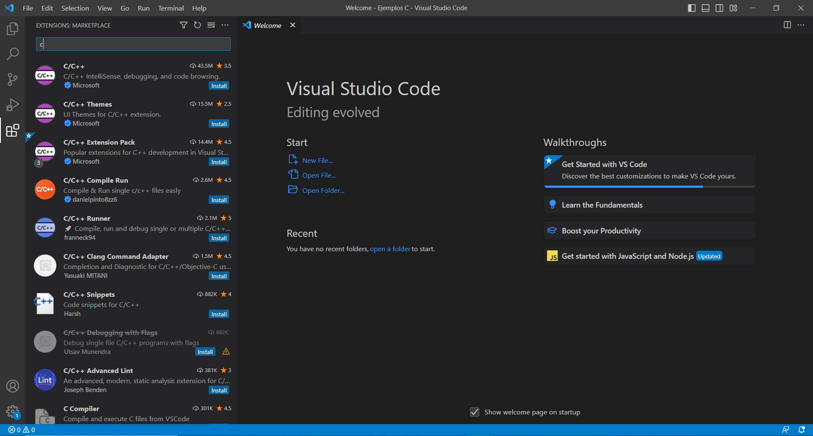

### Paso 3: Instalar C/C++ Extension

1. Busca la extensión "C/C++" de Microsoft
2. Haz clic en "Install"

Esta extensión proporciona:
- IntelliSense (autocompletado inteligente)
- Debugging (depuración)
- Code browsing (navegación de código)

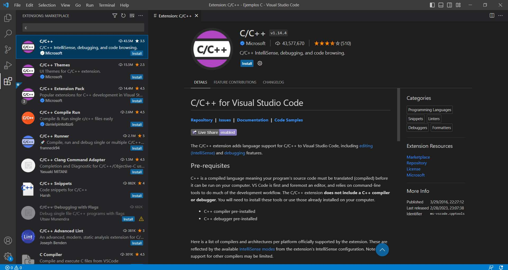

### Paso 4: Extensión instalada

Una vez instalada, verás el botón "Uninstall" en lugar de "Install".

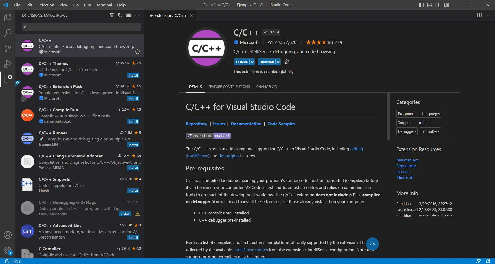

### Paso 5: Instalar C/C++ Extension Pack

También es recomendable instalar el "C/C++ Extension Pack" que incluye:
- C/C++ (extensión base)
- C/C++ Themes
- CMake
- CMake Tools

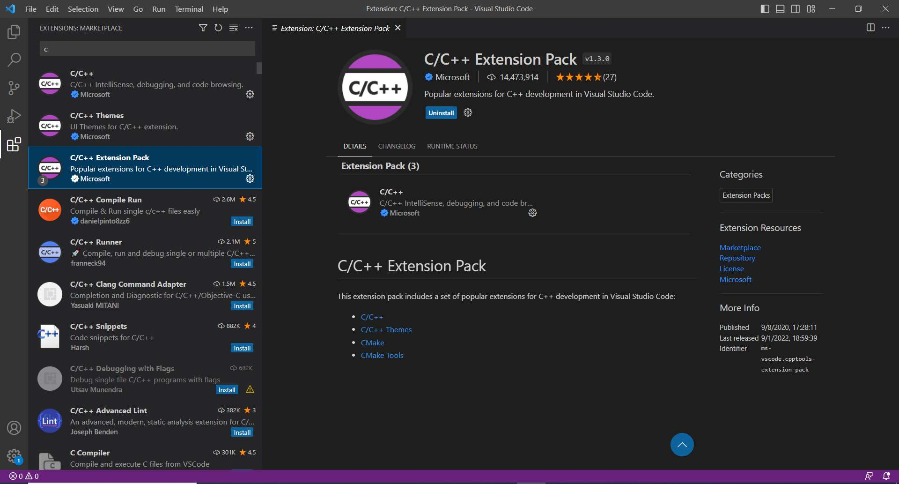

---

## 3. Primer programa C en Visual Studio Code

### Paso 1: Crear una carpeta para tu proyecto

1. En Visual Studio Code, ve a "File" > "Open Folder..."
2. Crea o selecciona una carpeta para tu proyecto (ejemplo: "Programacion II")

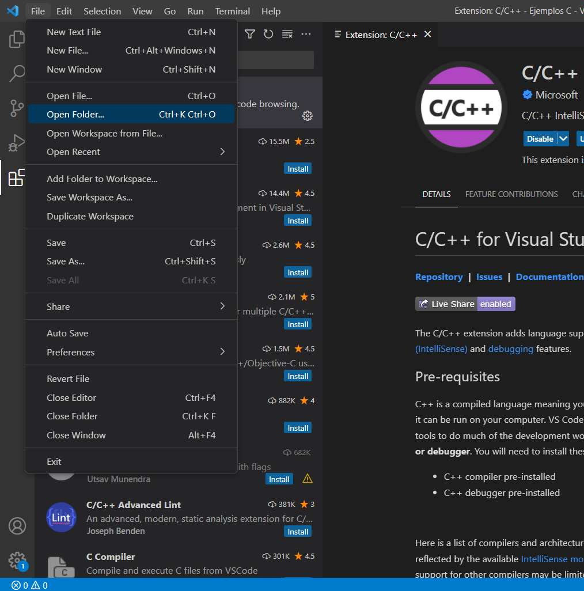

### Paso 2: Seleccionar la carpeta

Navega hasta la carpeta deseada y haz clic en "Seleccionar carpeta"

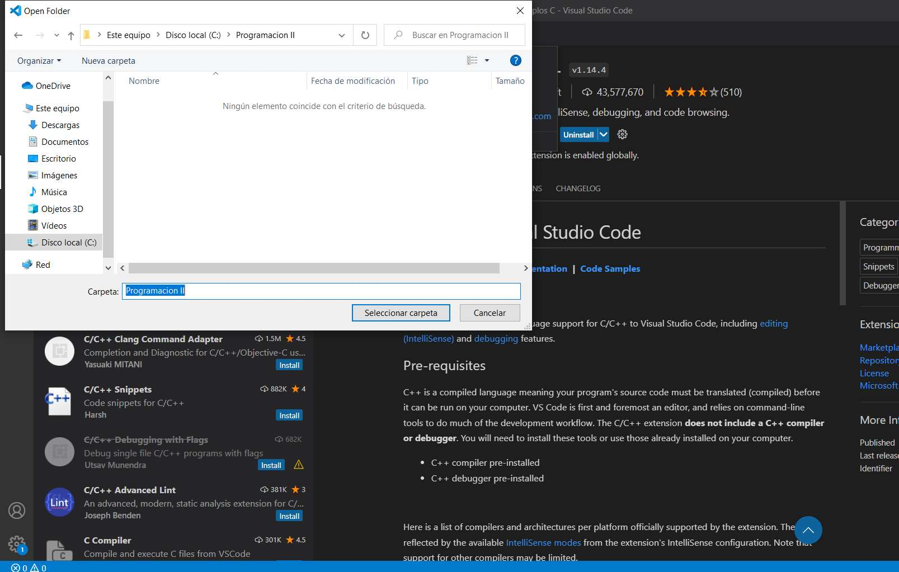

### Paso 3: Crear un nuevo archivo

1. Haz clic en el icono de nuevo archivo en el explorador
2. O usa el menú "File" > "New File"

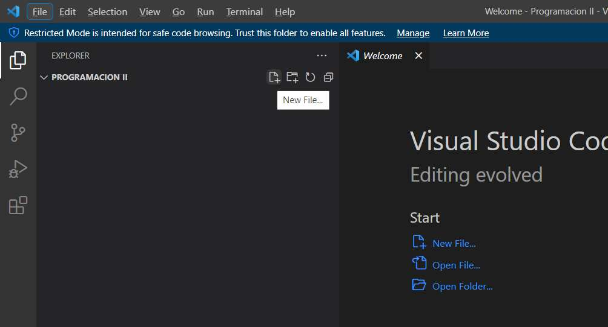
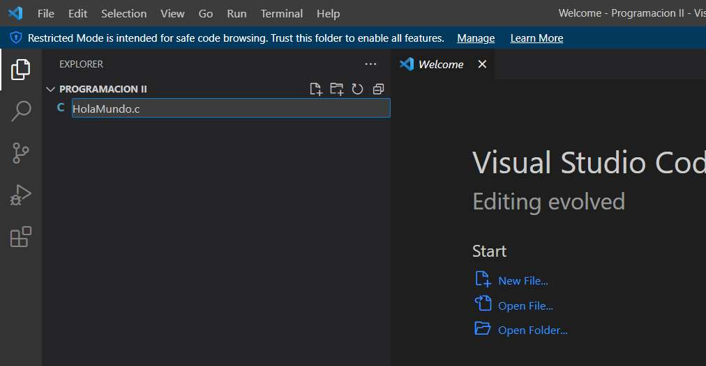

### Paso 4: Configurar IntelliSense (si es necesario)

Si aparece un mensaje sobre la configuración de IntelliSense:
1. Haz clic en "Configure IntelliSense"
2. Selecciona tu compilador (gcc.exe)
3. VS Code creará automáticamente un archivo `c_cpp_properties.json`

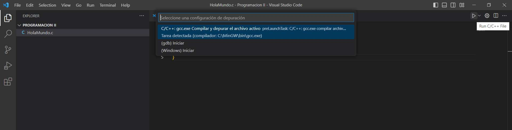

### Paso 5: Escribir tu primer programa

Abre el archivo creado (ej. `HolaMundo.c`) y escribe el siguiente código:

```c
#include <stdio.h>

int main(){
    printf("Hola Mundo!\n");
}
```

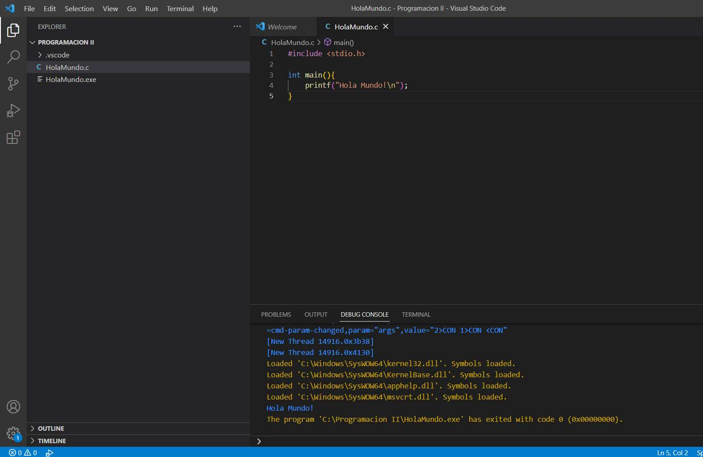

### Paso 6: Ejecutar el programa

1. Haz clic derecho en el archivo
2. Selecciona "Run Code" o presiona `Ctrl+Alt+N`

También puedes ver el archivo `tasks.json` que se genera automáticamente con la configuración del compilador.

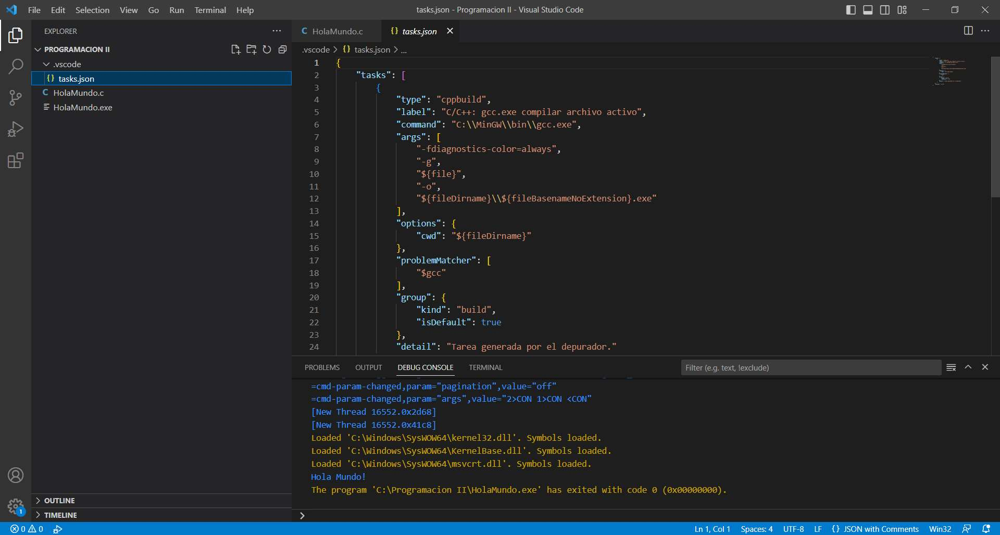

---
