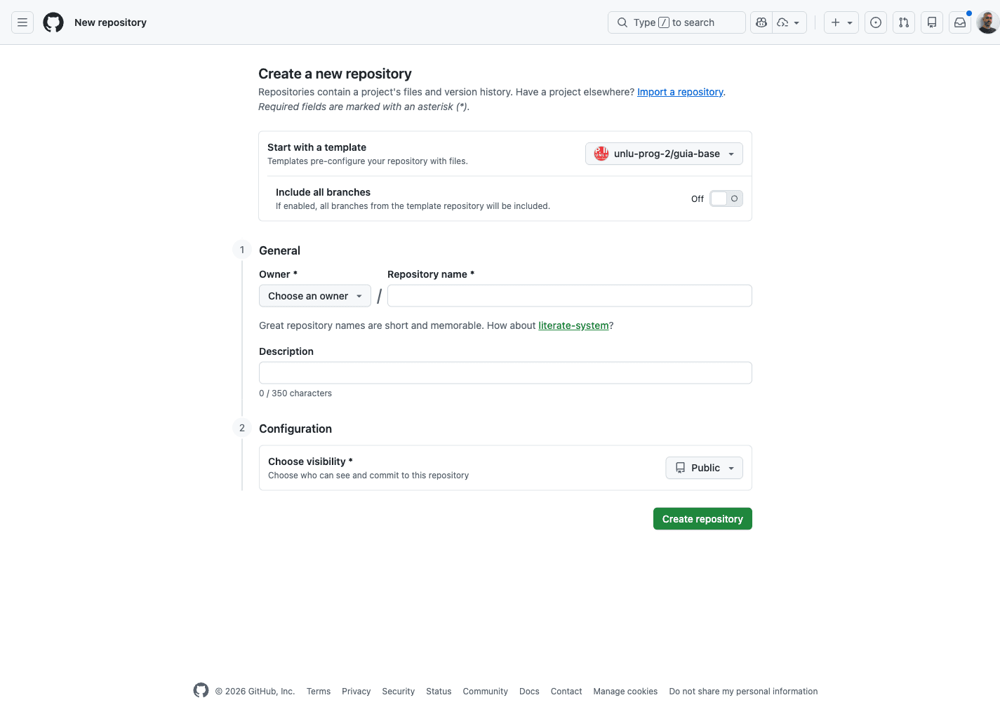
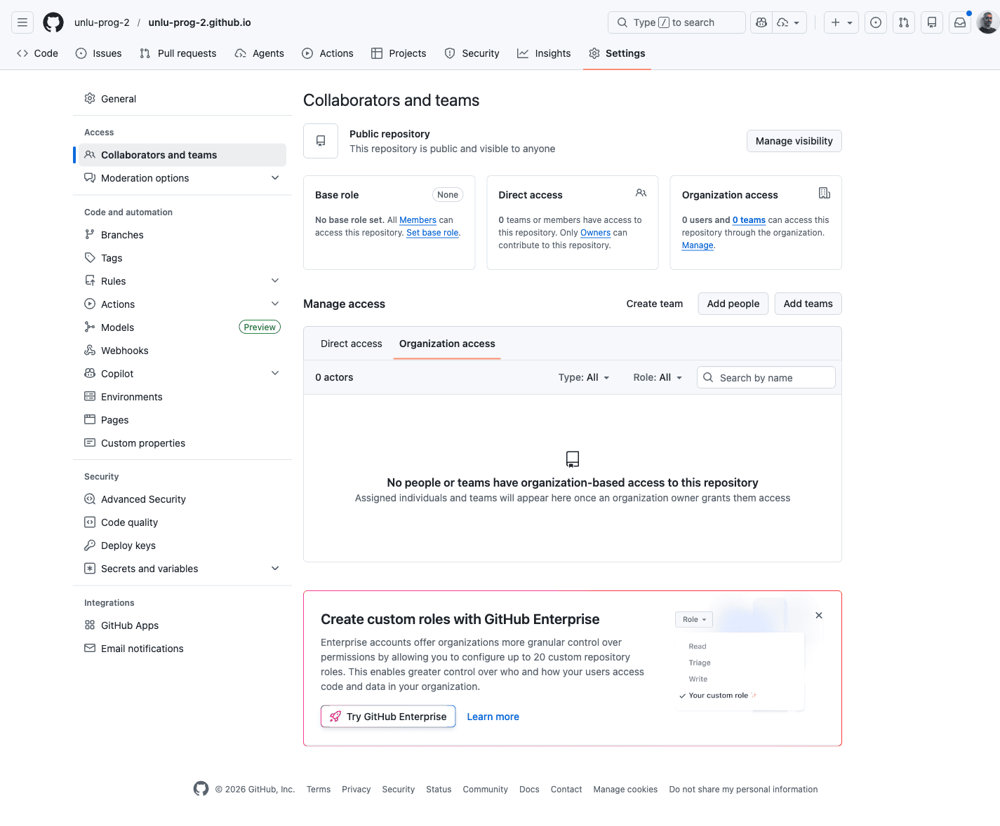
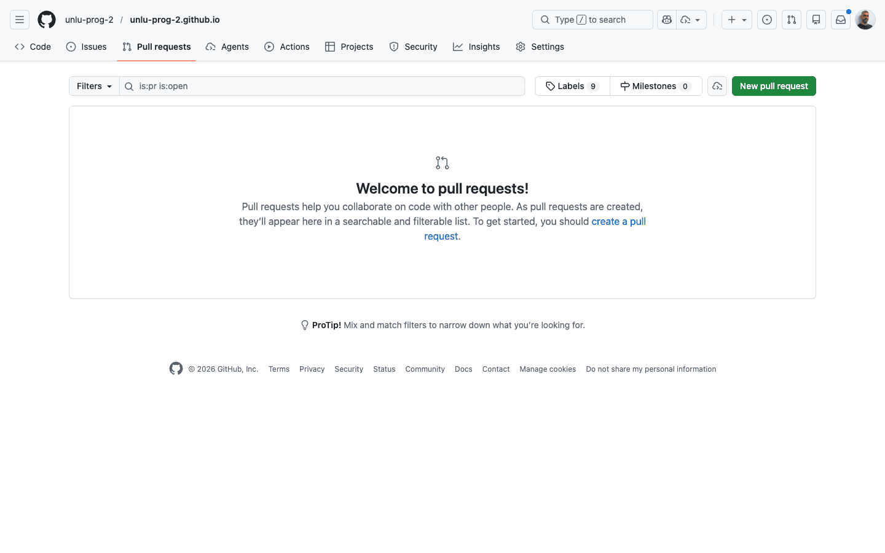

# Recetas rápidas de GitHub CLI (gh)

> Para usar con `gh` + `git` en terminal.

## 1. Cómo crear un repositorio a partir de la guia-base

1. Autenticarse:

```bash
gh auth login
```

2. Crear repo desde template:

```bash
gh repo create ORG_O_USUARIO/equipo-03 \
  --private \
  --template unlu-prog-2/guia-base \
  --clone
```

3. Entrar al repo:

```bash
cd equipo-03
```

## 2. Cómo agregar a tus compañeros de grupo al repositorio

1. Invitar colaborador (repetir por cada compañero):

```bash
gh api \
  --method PUT \
  /repos/ORG_O_USUARIO/equipo-03/collaborators/USUARIO_GITHUB \
  -f permission=push
```

2. Cada compañero acepta la invitación en GitHub.

## 3. Traerse los cambios hechos por otros miembros del equipo

1. Actualizar rama:

```bash
git pull origin main
```

## 4. Comitear tus cambios

1. Guardar cambios:

```bash
git add .
git commit -m "Mensaje corto"
git push origin main
```

## 5. Flujo alternativo para quienes quieran trabajar usando PRs

1. Crear rama:

```bash
git checkout -b feature/nombre-corto
```

2. Commit y push:

```bash
git add .
git commit -m "Mensaje corto"
git push -u origin feature/nombre-corto
```

3. Crear PR:

```bash
gh pr create --base main --fill
```

4. Ver PRs abiertas:

```bash
gh pr list
```

5. Merge de PR aprobada:

```bash
gh pr merge --merge --delete-branch
```

## 6. Cómo resolver conflictos con cosas que hayan hecho tus compañeros

1. Traer cambios:

```bash
git pull origin main
```

2. Resolver conflictos en archivos.
3. Marcar resuelto y subir:

```bash
git add .
git commit -m "Resuelve conflictos"
git push
```

## Capturas





