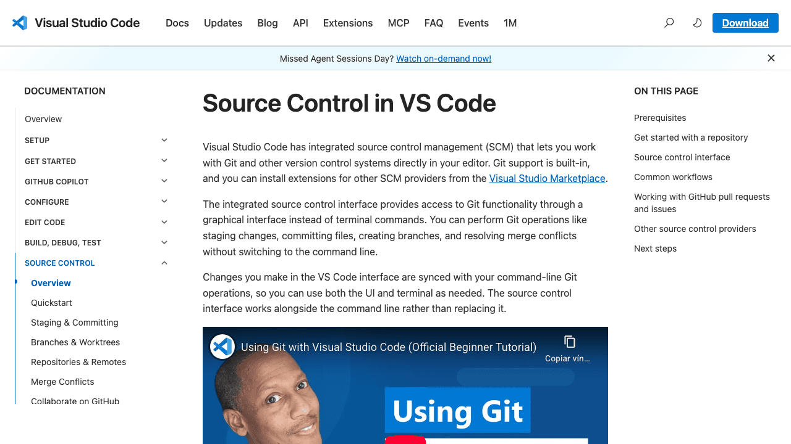

# Recetas rápidas de Git en VS Code

> Para usar Git desde la interfaz de Visual Studio Code.

## 1. Cómo crear un repositorio a partir de la guia-base

1. Crear repo desde `guia-base` en GitHub (Use this template).
2. En VS Code: **View > Command Palette**.
3. Ejecutar `Git: Clone`.
4. Pegar URL del repo nuevo y abrir carpeta.

## 2. Cómo agregar a tus compañeros de grupo al repositorio

1. En GitHub: **Settings** → **Collaborators and teams**.
2. Click en **Add people**.
3. Agregar usuarios de GitHub del grupo.

## 3. Traerse los cambios hechos por otros miembros del equipo

1. Abrir panel **Source Control**.
2. Click en **...** (More Actions).
3. Elegir **Pull**.

## 4. Comitear tus cambios

1. En **Source Control**, revisar cambios.
2. Click en **+** para stage (o **Stage All Changes**).
3. Escribir mensaje de commit.
4. Click en **Commit**.
5. Click en **Sync Changes** (o **Push**).

## 5. Flujo alternativo para quienes quieran trabajar usando PRs

1. Crear rama desde la barra inferior (nombre de rama).
2. Hacer cambios y commit en esa rama.
3. Push de la rama.
4. Abrir PR en GitHub (o con extensión GitHub Pull Requests).
5. Mergear PR y actualizar `main` con **Pull**.

## 6. Cómo resolver conflictos con cosas que hayan hecho tus compañeros

1. Hacer **Pull**.
2. Si hay conflicto, VS Code marca los archivos.
3. Usar botones: **Accept Current / Accept Incoming / Accept Both**.
4. Guardar archivo.
5. Stage + Commit de resolución.
6. Push.

## Capturas

