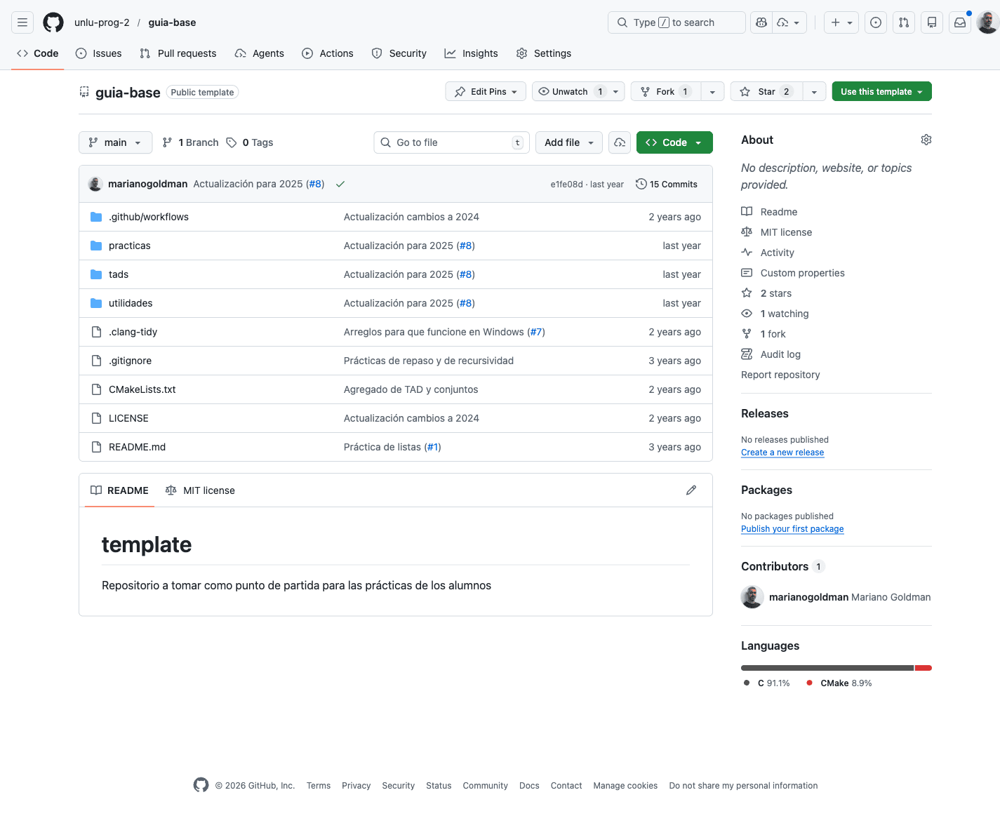

# Recetas rápidas de Git (equipo)

> Para usar en terminal con `git`.  
> Supone que ya tenés Git instalado y acceso a GitHub.

## 1. Cómo crear un repositorio a partir de la guia-base

1. Entrá a `https://github.com/unlu-prog-2/guia-base`.
2. Click en **Use this template** → **Create a new repository**.
3. Creá el repo del grupo (ejemplo: `equipo-03`).
4. Clonalo:

```bash
git clone git@github.com:ORG_O_USUARIO/equipo-03.git
cd equipo-03
```

## 2. Cómo agregar a tus compañeros de grupo al repositorio

1. En GitHub: **Settings** → **Collaborators and teams**.
2. Click en **Add people**.
3. Agregá los usuarios de GitHub de tu grupo.
4. Ellos aceptan la invitación.

## 3. Traerse los cambios hechos por otros miembros del equipo

1. Guardá tus cambios locales (`git status`).
2. Traé cambios remotos:

```bash
git pull origin main
```

3. Si trabajás en otra rama, cambiá `main` por esa rama.

## 4. Comitear tus cambios

1. Ver cambios:

```bash
git status
```

2. Agregar archivos:

```bash
git add .
```

3. Crear commit:

```bash
git commit -m "Mensaje corto y claro"
```

4. Subir al remoto:

```bash
git push origin main
```

## 5. Flujo alternativo para quienes quieran trabajar usando PRs

1. Actualizar `main`:

```bash
git checkout main
git pull origin main
```

2. Crear rama:

```bash
git checkout -b feature/nombre-corto
```

3. Hacer cambios, `add`, `commit`, y subir rama:

```bash
git push -u origin feature/nombre-corto
```

4. En GitHub: abrir **Pull Request** hacia `main`.
5. Revisar, aprobar y hacer merge.
6. Volver a `main` y actualizar:

```bash
git checkout main
git pull origin main
```

## 6. Cómo resolver conflictos con cosas que hayan hecho tus compañeros

1. Ejecutá `git pull origin main`.
2. Si hay conflicto, abrí los archivos marcados.
3. Buscá bloques con:

```text
<<<<<<< HEAD
=======
>>>>>>> rama-remota
```

4. Elegí qué código queda (o combiná ambos).
5. Borrá esas marcas.
6. Guardá y marcá como resuelto:

```bash
git add .
git commit -m "Resuelve conflictos"
git push origin main
```

## Capturas




