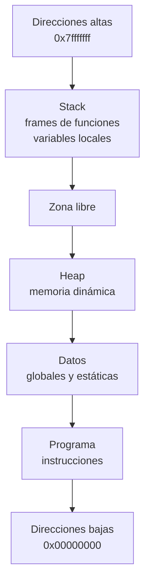
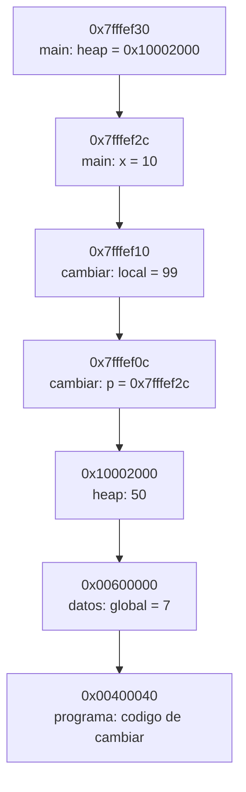

[← Volver a Programación II](../guia-prog2.md)

# Modelo de memoria en C

Esta guía resume el modelo de memoria que solemos usar para razonar programas en C. No representa todos los detalles de un sistema operativo real, pero sirve para entender punteros, variables, llamadas a función y memoria dinámica.

## Idea general

Cuando pensamos un programa en ejecución, imaginamos que dispone de un espacio de direcciones lineal. Cada byte tiene una dirección.

En ese espacio suelen distinguirse estas zonas:

- **Programa** o segmento de código: contiene las instrucciones ejecutables.
- **Datos**: variables globales y estáticas.
- **Pila** o **stack**: variables locales y datos de las llamadas a función.
- **Memoria dinámica** o **heap**: memoria pedida en tiempo de ejecución con `malloc`, `calloc`, `realloc` y liberada con `free`.

### Un mapa mental simple



En muchos entornos didácticos se dibuja el stack creciendo hacia direcciones menores y el heap creciendo hacia direcciones mayores. Ese modelo alcanza para explicar la mayoría de los ejercicios de la materia.

## Qué hacen el compilador y el linker

Antes de hablar de memoria conviene separar dos etapas:

### Compilador

El compilador toma archivos fuente `.c` y:

- verifica sintaxis y tipos;
- traduce el código C a código máquina o a un archivo objeto;
- decide cómo representar tipos, variables y llamadas según la arquitectura;
- deja referencias pendientes a funciones o variables definidas en otros archivos.

Por ejemplo, si en un archivo aparece:

```c
int contador = 10;

int duplicar(int x) {
    return x * 2;
}
```

el compilador separa, conceptualmente:

- las instrucciones de `duplicar` en la sección de código;
- la variable global `contador` en la sección de datos.

### Linker

El linker toma uno o más archivos objeto y:

- une todas las secciones de código y datos;
- resuelve referencias entre módulos;
- asigna una organización final al ejecutable;
- incorpora bibliotecas necesarias.

Por eso puede decirse, de forma simplificada, que:

- el **compilador** traduce cada módulo;
- el **linker** arma el programa completo.

Cuando el programa se ejecuta, el sistema operativo carga ese ejecutable en memoria y crea además el stack y el heap del proceso.

## 1. Segmento de programa

Es la zona donde están las instrucciones del programa.

```c
int sumar(int a, int b) {
    return a + b;
}
```

La función `sumar` no vive en el stack ni en el heap. Su código compilado forma parte del programa cargado en memoria.

En un dibujo plano podría verse así:

```text
Dirección      Contenido
0x00400000     instrucciones de main
0x00400040     instrucciones de sumar
0x00400080     instrucciones de imprimir
```

No se suele modificar esta zona desde el programa.

## 2. Segmento de datos

Acá se ubican las variables globales y las variables `static`.

```c
int global_inicializada = 25;
int global_no_inicializada;

void contar(void) {
    static int veces = 0;
    veces++;
}
```

Estas variables existen durante toda la ejecución del programa.

- `global_inicializada` arranca con valor `25`.
- `global_no_inicializada` arranca en `0`.
- `veces` conserva su valor entre llamadas a `contar`.

Modelo visual:

```text
Dirección      Variable
0x00600000     global_inicializada = 25
0x00600004     global_no_inicializada = 0
0x00600008     contar::veces = 0
```

Una idea importante: estas variables tienen dirección fija mientras dura la ejecución.

## 3. Pila o stack

La pila almacena la información de las llamadas a función. Cada llamada crea un **frame** con sus parámetros, variables locales y direcciones necesarias para volver a la función anterior.

```c
int cuadrado(int n) {
    int resultado = n * n;
    return resultado;
}

int main(void) {
    int x = 5;
    int y = cuadrado(x);
    return 0;
}
```

Mientras `main` está ejecutándose podría existir un frame parecido a este:

```text
Dirección      Stack frame de main
0x7fffef1c     y = ?
0x7fffef18     x = 5
```

Cuando `main` llama a `cuadrado(x)`, se agrega otro frame:

```text
Dirección      Stack frame de cuadrado
0x7fffef0c     resultado = 25
0x7fffef08     n = 5

Dirección      Stack frame de main
0x7fffef1c     y = ?
0x7fffef18     x = 5
```

Al terminar `cuadrado`, su frame desaparece. Por eso es un error devolver la dirección de una variable local:

```c
int *direccion_invalida(void) {
    int x = 10;
    return &x;
}
```

Después del `return`, `x` ya no existe.

## 4. Heap o memoria dinámica

El heap se usa cuando el tamaño o el tiempo de vida de los datos no se conocen bien en tiempo de compilación.

```c
#include <stdlib.h>

int main(void) {
    int *vector = malloc(3 * sizeof(int));

    if (vector == NULL) {
        return 1;
    }

    vector[0] = 10;
    vector[1] = 20;
    vector[2] = 30;

    free(vector);
    return 0;
}
```

Acá ocurren dos cosas distintas:

- la variable local `vector` vive en el stack;
- el bloque de tres `int` vive en el heap.

Modelo visual:

```text
Stack
0x7fffef20     vector = 0x10002000

Heap
0x10002000     10
0x10002004     20
0x10002008     30
```

El puntero guarda una dirección. No contiene el arreglo completo: contiene la ubicación del primer elemento.

## Ejemplo completo con direcciones

Tomemos este programa:

```c
#include <stdio.h>
#include <stdlib.h>

int global = 7;

void cambiar(int *p) {
    int local = 99;
    *p = local;
}

int main(void) {
    int x = 10;
    int *heap = malloc(sizeof(int));

    if (heap == NULL) {
        return 1;
    }

    *heap = 50;
    cambiar(&x);

    printf("x=%d, *heap=%d, global=%d\n", x, *heap, global);

    free(heap);
    return 0;
}
```

Podemos imaginar este estado durante la llamada a `cambiar(&x)`:



Lectura del diagrama:

- `x` está en el stack de `main`.
- `p` también está en el stack, pero en el frame de `cambiar`.
- `p` guarda la dirección de `x`.
- `local` es otra variable local, con otra dirección.
- `heap` guarda la dirección de un entero reservado dinámicamente.
- `global` está en el segmento de datos.
- el código de `cambiar` está en el segmento de programa.

Cuando se ejecuta `*p = local;`, el contenido de la dirección apuntada por `p` cambia. En este caso, cambia `x`.

## Lo que suele confundir

### El nombre de un arreglo no es una variable puntero

```c
int v[3] = {10, 20, 30};
```

`v` representa el comienzo del arreglo en muchas expresiones, pero el arreglo no es lo mismo que un `int *`.

### Un puntero también ocupa memoria

```c
int *p;
```

`p` tiene su propia dirección y además guarda otra dirección.

```text
0x7fffef40     p = 0x10002000
```

### `free` libera el bloque, no borra el puntero

Después de:

```c
free(p);
```

el bloque dinámico deja de ser válido, pero `p` sigue existiendo. Su valor queda indeterminado para usarlo como dirección válida. Un hábito útil es:

```c
free(p);
p = NULL;
```

### Stack y heap no son sinónimos de rápido y lento

La diferencia central no es de velocidad sino de **tiempo de vida**, **forma de administración** y **responsabilidad del programador**.

- el stack se administra automáticamente;
- el heap requiere pedido y liberación explícita;
- los errores en heap suelen producir pérdidas de memoria o accesos inválidos.

## Resumen para punteros

Cuando trabajás con punteros conviene preguntarte siempre estas cuatro cosas:

1. ¿Qué tipo de dato hay en la dirección apuntada?
2. ¿En qué región de memoria vive ese dato: datos, stack o heap?
3. ¿Sigue existiendo cuando quiero usarlo?
4. ¿Quién es responsable de liberarlo, si está en el heap?

Si esas cuatro respuestas están claras, la mayoría de los errores con punteros se vuelven mucho más fáciles de detectar.

## Una última advertencia

Las direcciones mostradas en esta guía son inventadas y sólo buscan ayudar a visualizar. En una computadora real pueden cambiar entre ejecuciones, sistemas operativos, compiladores y arquitecturas.

Lo importante no es memorizar números de dirección, sino entender:

- qué objetos existen;
- cuánto duran;
- quién los puede referenciar;
- en qué región de memoria están.